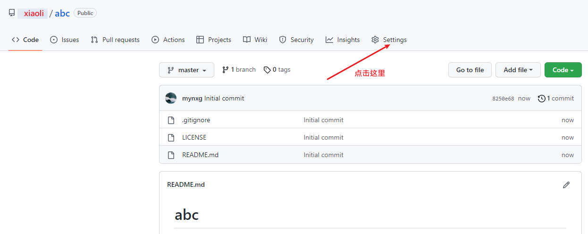
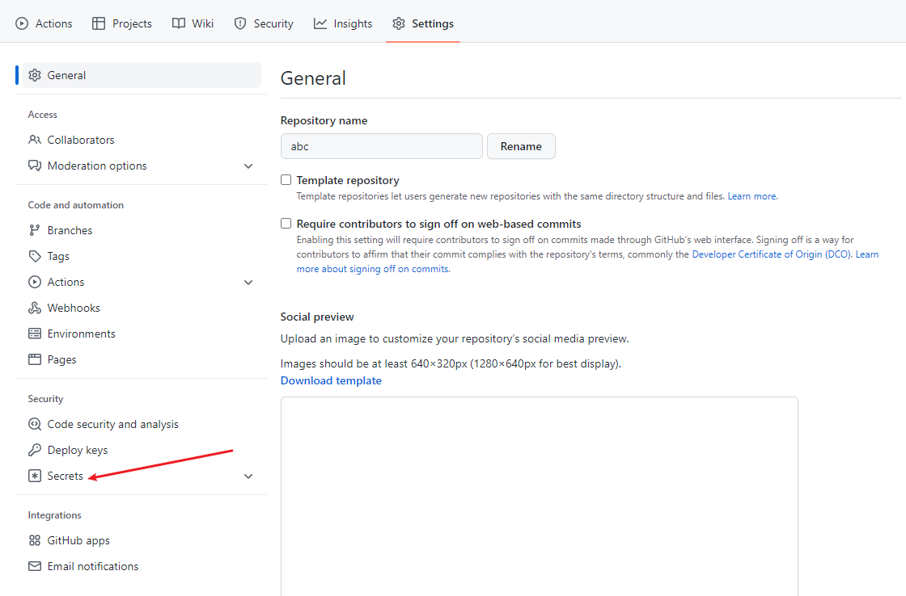
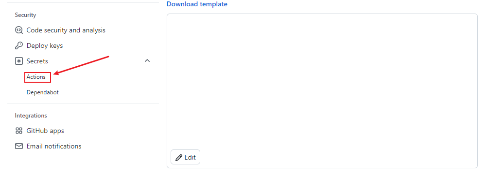
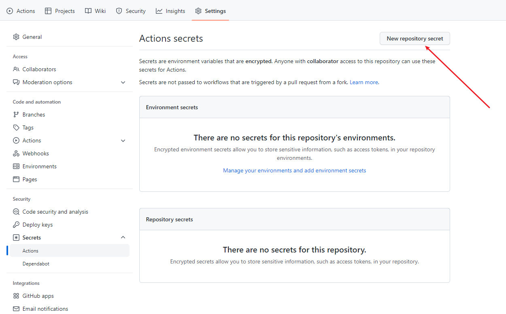
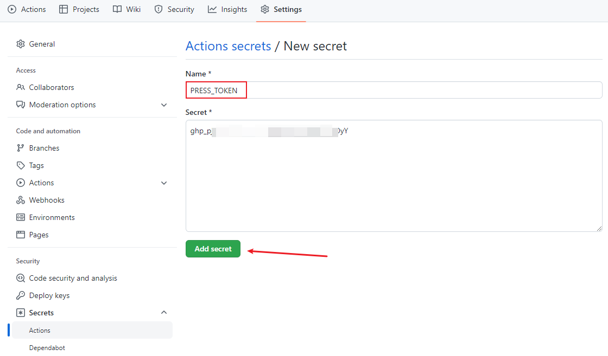
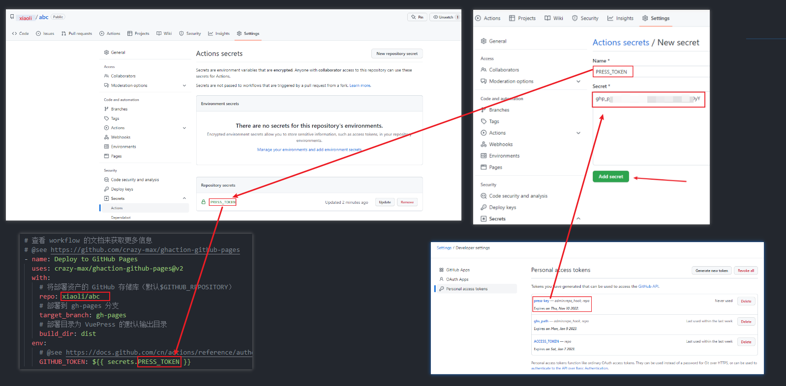
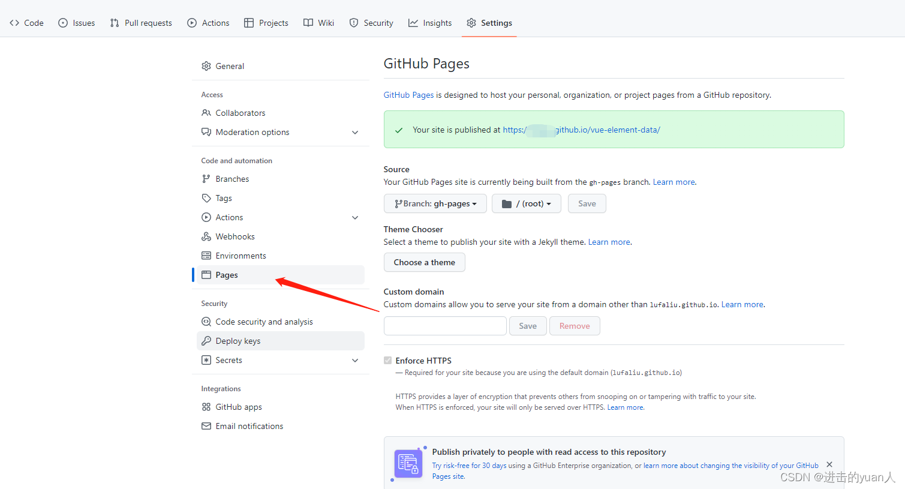

# vu2-demo-webassembly
## vue2对应库的版本说明
1. 安装less： npm i less less-loader@7
      查看版本 npm view+插件名（如：webpack）+ versions
      脚手架建议看webpack版本安装less-loader :建议安装  
      npm i less less-loader@7
       移除：npm uninstall less-loader

2. 安装路由：npm i vue-router@3
   2022年2月7日以后，vue-router的默认版本为4版本，vue-router4只能在vue3中使用，
   vue-router3才能在vue2中使用
   使用vue2要npm i vue-router@3

3. 安装vuex: npm i vuex@3

   2022年2月7日，vue3成为默认版本，如果直接npm i vue 安装的直接就是vue3了，并且vue3成为默认版本的同时，vuex也更新到了4版本，那么也就是说如果我们直接npm i vuex安装的是vuex4，而vuex的4版本只能在vue3中使用，vue2中要用vuex的3版本，vue3中要用vuex的4版本，所以使用vue2要安装vuex3,  :     npm i vuex@3

4. npm i sass@1.51.0    
   npm i sass-loader@10.1.1

5. vue.config.js 全局配置
   baseURL:'./'  // vue-cli版本是3.2.0以前的
	publicPath:'./' // publicPath属性适用于vue-cli 高于3.2.0的项目


## github action过程  









## github page
https://fengnovo.github.io/water-mark/
要设置对静态js路径 如  src="/water-mark/assets/index.d87e59da.js"

## Project setup
```
npm install
```

### Compiles and hot-reloads for development
```
npm run serve
```

### Compiles and minifies for production
```
npm run build
```

### Lints and fixes files
```
npm run lint
```
